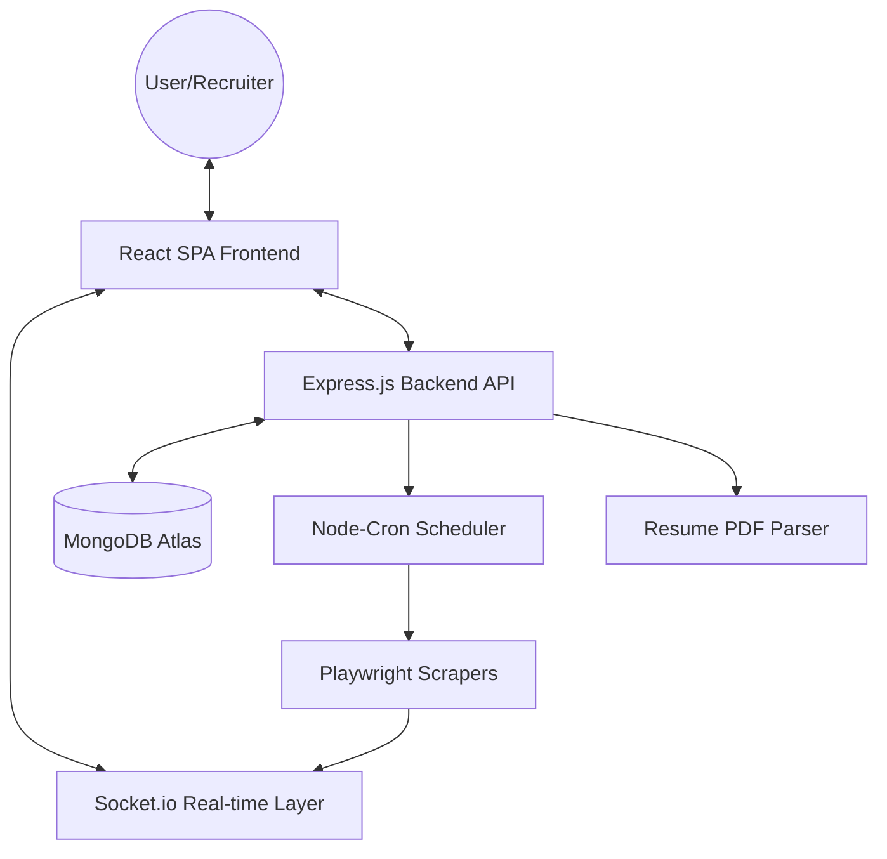

# Auto Job Notification & Recruiter Platform

## 🎯 Purpose
The **Auto Job Notification & Recruiter Platform** is a dual-purpose tool designed for both job seekers and recruiters. It automates the tedious process of job discovery for candidates while providing a powerful, multi-platform search engine for recruiters to find and verify the best talent globally.

---

## 🏗️ System Architecture

The platform follows a **decoupled MERN architecture** with an event-driven real-time communication layer:

### ✅ Architectural Components:
1.  **Client Tier (React)**: A highly interactive SPA built with a glassmorphism design system. It maintains a persistent Socket.io connection for "Match Logs."
2.  **API Tier (Node/Express)**: Handles business logic, user management, and exposes RESTful endpoints for campaigns and candidates.
3.  **Real-time Tier (Socket.io)**: A bidirectional event bus that streams scraper progress logs and candidate matches from the backend services directly to the UI.
4.  **Service Tier (Automation)**: 
    - **Scrapers**: Playwright-based workers that discover jobs/candidates.
    - **Scheduler**: Orchestrates recurring background scans.
5.  **Data Tier (MongoDB)**: Stores relational data in a flexible document format.

---

## 🚀 Key Features

### **For Job Seekers**
- **Automated Scraper**: Scans LinkedIn, Indeed, and Naukri for jobs posted in the last 7 days.
- **Resume Parsing**: Extracts skills and experience levels directly from your uploaded PDF/Doc.
- **Campaign Manager**: Manage multiple search profiles with different criteria and resumes.
- **Live Monitoring**: Real-time terminal on the dashboard showing background search status.

### **For Recruiters**
- **Internal Talent Pool**: Search through registered user profiles using specific skill, location, and experience filters.
- **Global Discovery (New)**: Search the entire web index for professional profiles on **LinkedIn, Indeed, and Naukri** using resilient Google Dorking technology.
- **Candidate Verification**: Access direct links to candidate's LinkedIn, Indeed, and Naukri profiles for immediate vetting.
- **"Review for Hire" View**: A centralized dashboard to see candidate summaries, years of experience, and download resumes.
- **Real-time Discovery Logs**: Watch the scraping process live via the unified Match Logs terminal.

---

## 🛠️ Tech Stack & Dependencies

### **Frontend (React)**
- **UI/UX**: Custom Glassmorphism design system using Vanilla CSS.
- **Icons**: `Lucide React` and `Framer Motion`.
- **Communication**: `Axios` and `Socket.io-client`.

### **Backend (Node.js)**
- **Automation**: `Playwright` for web scraping and discovery.
- **Intelligence**: `pdf-parse` for resume processing.
- **Real-time**: `Socket.io` for live log broadcasting to recruiters and candidates.
- **Storage**: `Multer` for file uploads, `Mongoose` for MongoDB Atlas integration.
- **Scheduler**: `Node-Cron` for recurring background tasks.

---

## 📖 How To Use

### **1. As a Candidate**
- Go to the **Profile** page, upload your resume, and set your target location.
- Provide your professional links (LinkedIn/Indeed) for recruiter verification.
- Check the **Dashboard** for live matches found across job boards.

### **2. As a Recruiter**
- Navigate to the **Find Candidates** section.
- **Internal Search**: Find candidates already registered in the system.
- **Global Scan**: Toggle "Global Scan" to discovery talent across the web index.
- Click **"Review for Hire"** on any candidate to access their full profile and professional links.

---

## ⚙️ Setup & Installation
1.  **Backend**: `cd backend && npm install`. Create `.env` with `MONGODB_URI`, `EMAIL_USER`, `EMAIL_PASS`, and `PORT`.
2.  **Frontend**: `cd frontend && npm install && npm run dev`.
3.  **Real-time Support**: Ensure your local firewall allows Socket.io connections on the backend port.

---

## 🛡️ License
ISC License
